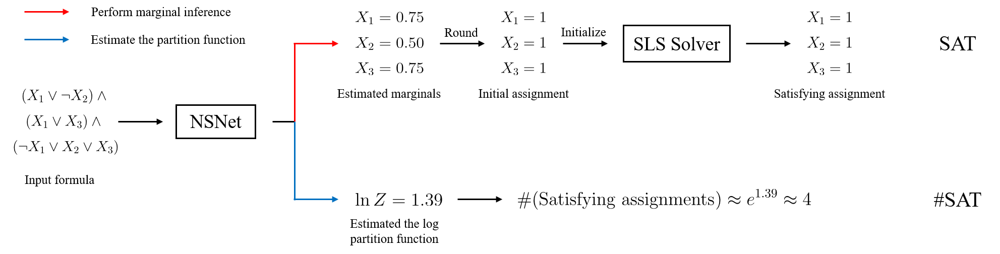

# NSNet



This is the official PyTorch implementation of the paper

[NSNet: A General Neural Probabilistic Framework for Satisfiability Problems](https://arxiv.org/pdf/2211.03880.pdf)</br>
[Zhaoyu Li](https://www.zhaoyu-li.com) and [Xujie Si](https://www.cs.mcgill.ca/~xsi/)</br>
In *36th Conference on Neural Information Processing Systems (NeurIPS 2022)*.

## Installation

Our implementation is mainly based on Python 3.8, PyTorch 1.11.0, and PyG 2.0.4.

Since our codebase includes some external repositories, you can use the following line to clone the repository:

```bash
git clone --recurse-submodules https://github.com/zhaoyu-li/NSNet.git
```

To compile/use some external solvers (DSHARP[^1], MIS[^2]), you may use the following lines to set up:

```bash
# install GMP and Boost libraries for DSHARP and MIS
sudo apt-get install libgmp3-dev libboost-all-dev
cd NSNet/external/MIS
make
cd ../..
```

One can then install other dependencies to a virtual environment using the following lines:

```bash
pip install torch==1.11.0
pip install torch-geometric==2.0.4 torch-scatter==2.0.9 torch-sparse==0.6.13
pip install -r requirements.txt
```

## Reproduction

We provide scripts to generate/download the SAT and #SAT datasets and train/evaluate NSNet and other baselines for both SAT and #SAT problems.

To obtain the SAT and #SAT datasets, you may first use the following scripts:

```bash
# replace ~/scratch/NSNet in the following scripts to your own data directory
bash scripts/sat_data.sh
bash scripts/mc_data.sh
```

To train and evaluate a specific model on a SAT dataset without local search, you may try or modify these scripts:

```bash
# test BP on the SR dataset
bash scripts/sat_bp_sr.sh

# train and test NSNet on the 3-SAT dataset
bash scripts/sat_nsnet_3-sat.sh

# train and test NeuroSAT on the CA dataset
bash scripts/sat_neurosat_ca.sh
```

Note that each of the above scripts evaluates a model on both same-size and larger instances as training. NSNet and NeuroSAT are also trained in two settings (with marginal supervision/assignment supervision).

To test a specific model on a SAT dataset with local search (i.e., combine a model with the SLS solver Sparrow), you may try these scripts:

```bash
# test Sparrow using BP as the initialization method on the SR dataset
bash scripts/sat_bp-sparrow_sr.sh

# test Sparrow using NSNet as the initialization method on the 3-SAT dataset
# one may modify the checkpoint path in the script
bash scripts/sat_nsnet-sparrow_3-sat.sh

# test Sparrow using NeuroSAT as the initialization method on the CA dataset
# one may modify the checkpoint path in the script
bash scripts/sat_neurosat-sparrow_ca.sh
```

To train/evaluate a specific approach on a #SAT dataset, you may try or modify these scripts:

```bash
# test ApproxMC3 on the BIRD benchmark
bash scripts/mc_approxmc3_bird.sh

# train and test NSNet on the BIRD benchmark
bash scripts/mc_nsnet_bird.sh

# test F2 on the SATLIB benchmark
bash scripts/mc_f2_satlib.sh
```

For the neural baseline BPNN, we run it using the official implementation[^3], training and testing in the same setting as NSNet.

## Citation

If you find this codebase useful in your research, please consider citing the following paper.

```bibtex
@inproceedings{li2022nsnet,
  title={{NSN}et: A General Neural Probabilistic Framework for Satisfiability Problems},
  author={Zhaoyu Li and Xujie Si},
  booktitle={Advances in Neural Information Processing Systems (NeurIPS)},
  year={2022},
}
```

[^1]: https://github.com/QuMuLab/dsharp
[^2]: https://github.com/meelgroup/mis
[^3]: https://github.com/jkuck/BPNN
